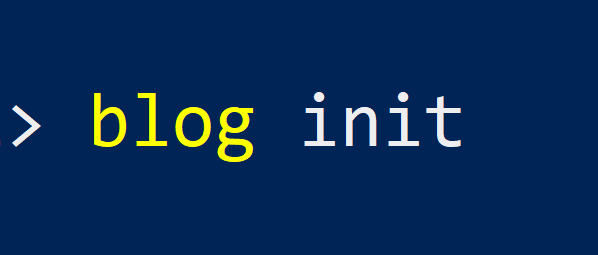

+++
title = "blog init"
date = 2020-03-29
+++

The idea behind this blog is the same you see everywhere: document personal projects that I think are relevant enough to document and for others to take a look.

In the process of getting this blog online I'm exercising some skills that were a bit rusty from not using, like git, web development and CI/CD. On a recent voluntary project I remembered how valuable they can be.

Talking about stack, this blog is uploaded on Github Pages (free tacos), generated by Zola, a (fast) Static Site Generator written in Rust and is auto-deployed on Github Actions.
