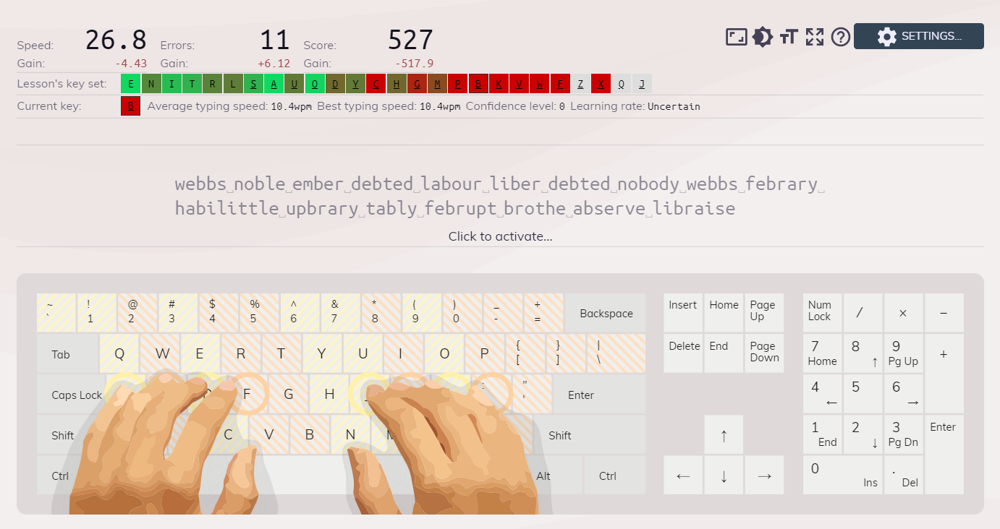
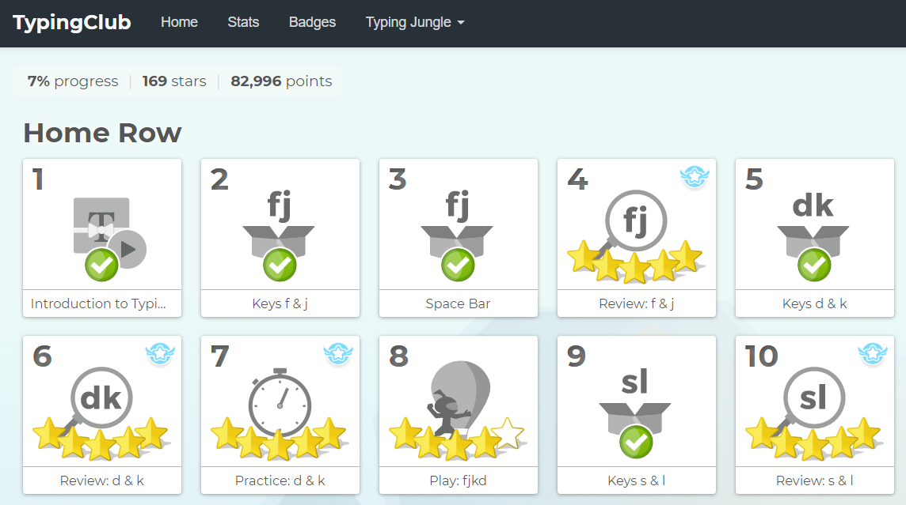
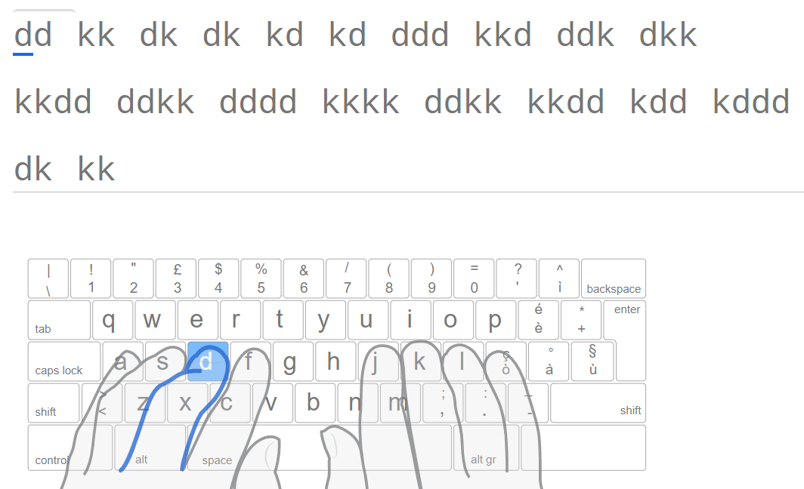

+++
title = "typing"
date = 2020-04-08
+++

I've always had a hard relasionship with typing. I don't know why, but I never learned how to type without looking at the keyboard, and this bothers me a lot. Not so much because of the speed, I can type at about 60 word per minute, what is above the average, but because of the fact that I need to look at the keyboard. You see, whenever I look at the keyboard, I'm not looking to the content I am writing, and whenever I want to look at the content I am writing, I have to move my eyes and my head and this causes an big disconfort after a few minutes, which makes me want to stop working and go somewhere else.

Last year, at about november, I decided to put an end on that, and started training to touch-typing (this is the therm used for typing with muscle-memory, not looking). I started on [KeyBr](https://www.keybr.com/), and on the beggining the learning was fast and I was motivated, but after one or two months on it I felt the learning was too slow. It uses a system where it add new keys only when you are very fast on the previous ones, and for that it tested each key with all the others. Don't need to say that after about ten keys, adding a new one took too much time. I have the feeling now that their system is good if you already touch-type but wants to improve your speed. Not my case.

Yesterday I was looking for an alternative and found [this article](https://www.freecodecamp.org/news/i-learned-to-touch-type-at-the-ripe-old-age-of-29-was-it-worth-it-112ef2150fec/), where the author was in a situation very similir to mine. In the article it indicated [TypingClub](https://www.typingclub.com/), a website with a different learning approach. It is a guided plataform, with a series of pre-defined exercises, videos and mini-games.

On the last two days I used Typing Club to train and I'm liking it a lot more than KeyBr. I trully think I'm learning, and learning fast. On the first day I finalized the middle-row-only exercises and today I finalized the upper-row ones. My progress is at 7% already, at about 30 min a day.

Despite what I thought innitialy, the videos were very helpful. They talked about posture, do's and no-do's and other tips.

I hope to start touch-typing beyond the site till the next month. Let's see.